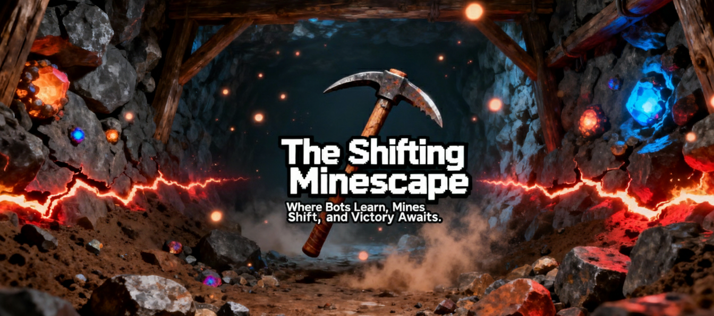

<p align="center">
  
</p>

<h1 align="center">The Shifting Minescape</h1>

<p align="center">
  <em>A competitive multi-agent reinforcement learning maze game where AI bots evolve in real-time as you race through a dynamically shifting underground mine.</em>
</p>

<p align="center">
  <strong>Where Bots Learn, Mines Shift, and Victory Awaits.</strong>
</p>

---

## 🎮 What Is This?

**The Shifting Minescape** is an advanced game combining cutting-edge reinforcement learning with real-time procedural maze generation. You race against 1-4 AI bots inside an ever-changing underground mine where:

- **Walls crumble and new paths emerge** in real-time during gameplay
- **AI bots learn and improve** with each playthrough using Deep Q-Networks (DQN)
- **You control difficulty, bot intelligence, and learning rates** via an intuitive developer panel
- **Premium mining aesthetic** with polished animations, glowing ore deposits, and particle effects
- **All agents compete simultaneously** in a high-stakes race to the goal

---

## ✨ Key Features

### 🌀 Dynamic Maze System
- Real-time maze transformation during gameplay—not between rounds
- Walls crumble and rebuild with animated transitions
- Configurable shift frequency (2–30 seconds) and complexity
- Procedurally generated layouts ensure variety every match

### 🤖 Reinforcement Learning Bots
- Deep Q-Network (DQN) agents that actively learn and improve
- Bots observe local maze state, goal distance, and agent positions
- Reward shaping encourages efficient pathfinding and goal completion
- Trained models persist between sessions—bots get smarter over time
- Watch bot learning curves improve in real-time

### ⚙️ Developer Control Panel
Configure gameplay on-the-fly with smooth, animated sliders:
- **Bot Intelligence:** Dumb, Learning, Expert, or Custom (set training episodes)
- **Learning Rate (α):** Control how fast bots adapt (0.0–1.0)
- **Discount Factor (γ):** Balance short-term vs. long-term planning (0.0–1.0)
- **Exploration vs. Exploitation:** Fine-tune bot randomness and convergence
- **Maze Shift Frequency:** 2–30 seconds (updates instantly)
- **Maze Complexity:** Adjust branch density, dead-ends, corridor width
- **Bot Count:** 1–4 opponents, selectable
- **Collision Mechanics:** Stun duration, collision radius, damage toggle

### 🏆 Competitive Gameplay
- Real-time leaderboard tracking positions and times
- Collision system stuns rivals and creates tactical opportunities
- Minimap showing detected maze layout and all agent positions
- Stats tracking: completion time, path efficiency, win rates
- Replay system to analyze bot strategies


---

## 🚀 Quick Start

### Installation
```bash
git clone https://github.com/yourusername/the-shifting-minescape.git
cd the-shifting-minescape
npm install
```

### Development
```bash
npm run dev
# Game runs on http://localhost:3000
```

### Production Build
```bash
npm run build
npm run serve
```

---

## 🎮 How to Play

1. **Launch the game** → Beautiful animated menu appears
2. **Configure settings** (optional) → Adjust bot count, difficulty, maze shift speed
3. **Start Game** → Race to the goal against AI bots
4. **Navigate & Compete** → Avoid dead-ends, watch for maze shifts, outrun rivals
5. **Win or Learn** → View detailed stats and bot learning curves post-game

### Controls
| Action | Key(s) |
|--------|--------|
| Move Up | W / ↑ |
| Move Down | S / ↓ |
| Move Left | A / ← |
| Move Right | D / → |
| Pause / Settings | ESC |

---

## 🛠️ Technology Stack

| Layer | Technology |
|-------|-----------|
| **Game Engine** | Phaser 3 |
| **RL Framework** | TensorFlow.js |
| **State Management** | Redux |
| **Build Tool** | Vite |
| **Styling** | SCSS / CSS-in-JS |
| **Rendering** | WebGL / Canvas (60+ FPS) |
| **Storage** | IndexedDB (bot models, scores) |

---

## 📁 Project Structure

```
src/
├── main.js                      # Entry point
├── config/
│   └── GameConfig.js            # Global configuration & constants
├── scenes/
│   ├── MenuScene.js             # Animated main menu
│   ├── GameScene.js             # Main gameplay loop
│   ├── PauseScene.js            # Pause & developer panel
│   └── VictoryScene.js          # Results & stats breakdown
├── maze/
│   ├── MazeGenerator.js         # Procedural generation (Eller's algorithm)
│   └── MazeShifter.js           # Dynamic maze transformation
├── agents/
│   ├── Agent.js                 # Base agent class
│   ├── Player.js                # Player-controlled agent
│   └── Bot.js                   # AI bot with RL integration
├── ai/
│   ├── DQNAgent.js              # Deep Q-Network implementation
│   └── ReplayBuffer.js          # Experience replay for training
├── physics/
│   ├── Collision.js             # Collision detection & response
│   └── Movement.js              # Agent movement & physics
├── ui/
│   ├── HUD.js                   # Real-time HUD (leaderboard, stats)
│   ├── Minimap.js               # Animated minimap overlay
│   └── SettingsPanel.js         # Developer control sliders
├── effects/
│   ├── Particles.js             # Particle system (dust, debris)
│   ├── Animations.js            # Smooth tweens & transitions
│   └── Lighting.js              # Dynamic lighting & glow
└── utils/
    ├── MathUtils.js             # Helper functions
    ├── StorageUtils.js          # IndexedDB model persistence
    └── AudioManager.js          # Sound & music playback
```

---

## 🧠 Reinforcement Learning Details

### Algorithm: Deep Q-Network (DQN)
- **State Space:** Discretized grid around agent + distance to goal + nearby agent positions
- **Action Space:** 4–8 directions (4-way or 8-way movement)
- **Reward Shaping:**
  - ✅ +1.0 for moving closer to goal
  - ✅ +10.0 for reaching goal
  - ✅ +0.5 for efficient path (no backtracking)
  - ❌ -0.1 per step (encourages speed)
  - ❌ -1.0 for collision (penalizes aggression)
  - ❌ -0.5 for infinite loops

### Neural Network Architecture
- **Input Layer:** Flattened state representation (50–100 neurons)
- **Hidden Layers:** 2–3 fully connected layers (64–128 neurons, ReLU activation)
- **Output Layer:** Q-values for each action (4–8 outputs)

### Training
- Bots train via experience replay with batch size of 32
- Learning happens in background during idle time and between rounds
- Models are serialized and persisted in IndexedDB
- Transfer learning allows bots to fine-tune on new maze complexities

---

## 🧪 Testing & Performance

- **Target FPS:** 60+ (stable on mid-range devices)
- **Input Latency:** <100ms player controls
- **Bot Decision Rate:** Update every 100–200ms (balance responsiveness + compute)
- **Maze Generation:** <50ms per full regeneration
- **Model Training:** Happens asynchronously via Web Workers

---

## 📊 Game Metrics & Stats

Every game tracks:
- **Completion Time:** How fast you reached the goal
- **Path Efficiency:** Ratio of optimal vs. actual path length
- **Distance Traveled:** Total tiles traversed
- **Collisions:** Number of agent-agent collisions
- **Bot Learning Curve:** Reward per episode, convergence rate
- **Win Rate:** Player vs. each bot over session

---

## 🤝 Contributing

Contributions welcome! Areas for enhancement:
- Advanced RL algorithms (Policy Gradients, A3C)
- Additional visual themes & customization
- Mobile touch controls optimization
- Multiplayer networking layer
- Advanced procedural generation techniques

To contribute:
1. Fork the repo
2. Create a feature branch (`git checkout -b feature/amazing-feature`)
3. Commit changes (`git commit -m 'Add amazing feature'`)
4. Push to branch (`git push origin feature/amazing-feature`)
5. Open a Pull Request

---

## 📄 License

This project is licensed under the **MIT License** — see the [LICENSE](LICENSE) file for details.

---

## 💡 Inspiration & Credits

- **RL Concepts:** Deep Q-Networks (Mnih et al., 2013)
- **Game Engine:** [Phaser 3 Documentation](https://phaser.io)
- **RL Framework:** [TensorFlow.js](https://www.tensorflow.org/js)
- **Mining Aesthetic:** Inspired by retro mining games, modern minimalism, and premium game design

---

## 🚀 Deploy

The game is optimized for web deployment:
- **Vercel:** `npm run build && vercel deploy`
- **Netlify:** Connect repo, auto-deploys on push
- **Firebase:** `npm run build && firebase deploy`

---

## 📬 Contact & Support

Have questions, bugs, or feature requests? Open an [issue](https://github.com/akshajsun/the-shifting-minescape/issues) or reach out!

---

<p align="center">
  <strong>Made with ⛏️ and 🤖</strong>
</p>

<p align="center">
  <em>The Shifting Minescape — Where Bots Learn, Mines Shift, and Victory Awaits.</em>
</p>
